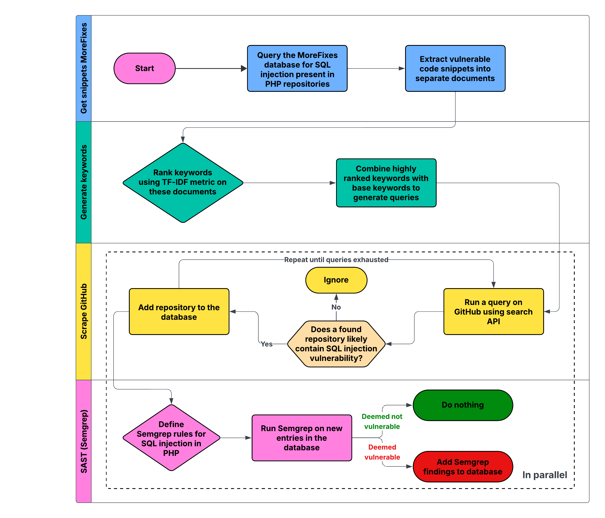

# SQLsweePHPer

SQLsweePHPer is a tool that automates SQL injection vulnerability discovery in public repositories on GitHub.
At the moment, given documents, it produces strong keywords for GitHub search, allowing circumvention of its inherent limitations regarding number of results.

This allows the tool to discover a vast number of repositories that could contain vulnerabilities.
Once files are found within the scope of our interest, we run SemGrep to semantically consider whether these contain an actual vulnerability.
Future research could be automated proof-of-concept generation.

## 🔧 Installation

This program was developed and tested on **GNU/Linux**.  Running it inside a Docker-in-Docker (DIND) environment is **not recommended**, as nested containers may bypass the intended sandboxing.

Requirements:  

- **Docker** and **Docker Compose** installed and available in your shell
- Pipeline must run either as **root** (recommended for Docker commands), or with Docker accessible to the current user (⚠️ this may reduce security)  
- Semgrep
- A working **MoreFixes** database  

Since the MoreFixes database is required, please refer to the [MoreFixes repository](https://github.com/JafarAkhondali/Morefixes) for detailed installation instructions.

```bash
# Clone repository
git clone 
cd DotDotDefender

# Configure environment variables
cp env.example .env
nano .env 

# Start database container
sudo docker-compose up -d

# Set up Python environment 
python3 -m venv .venv
source ./.venv/bin/activate
pip install -r requirements.txt
```

### 📌 Important: PYTHONPATH

Each time you want to run the SQLsweePHPeer pipeline, ensure your Python path is set:

```bash
export PYTHONPATH=$(pwd)
```

### 📁 MoreFixes Dataset

A dump of the MoreFixes dataset must be placed inside the `MoreFixes/` directory.
Adjust the configuration in:

```bash
MoreFixes/docker-compose.yml
```

to match your local paths and database settings.

## Usage

This program consists of several components. Each one is designed to run independently, contributing to the overall pipeline. Run each file from within its own directory:

1. **MoreFixes**  
   Extracts PHP code snippets containing SQL injection vulnerabilities from the past five years.
   File: `MoreFixes/sql_results_to_documents.sh`

2. **Scraper**  
   Searches GitHub repositories for vulnerable code patterns using the GitHub Code Search API.
   File: `scrapper/recursive-scrapper.py`

3. **Static Analysis**  
   Confirms and validates vulnerabilities by running **Semgrep** using targeted SQL injection rules.
   File: `sast/grep.py`

An overview of the full pipeline can be seen below.


## 🤝 Contributing

We welcome contributions to improve **SQLsweePHPer**! Morover you are more than welcome to maintain your own fork and research.

If you’d like to add features, fix bugs, or improve documentation, please follow these steps:  

1. Fork it!
2. Create your feature branch: `git checkout -b my-new-feature`
3. Commit your changes: `git commit -am 'Add some feature'`
4. Push to the branch: `git push origin my-new-feature`
5. Submit a pull request

## License

Although the source code of this pipeline is free to use, parts related to SAST (SemGrep) may have **different licenses** depending on your usage.  It is the user’s responsibility to verify and comply with all applicable license agreements.  
